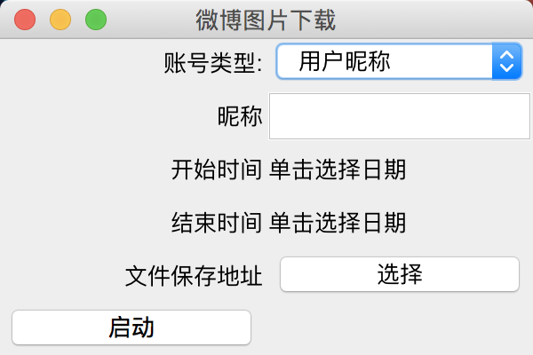

# 免登录下载微博图片

批量下载特定用户的高清大图。

## 用法

编译，使用`MainGui`主类运行

1. ~~按照需求点入相应的信息~~ 由于微博接口变动 目前支持根据ID下载
2. 如果对账号类型有疑问的话，可以参考[我的博客](https://www.cnblogs.com/yanximin/p/10982235.html)
3. 等待下载完成即可. So Easy!

## 更新说明
- 2017年9月18日  
    - 修复显示文件下载目录时出现的ID重复问题  
    - 优化代码  
    - 服务器上没有后缀名的图片默认设置为`jpg`格式
- 2017年9月17日
    - 重构代码
    - 增加了多线程下载，下图的速度更快了~
    - 修复下载GIF图片时后缀不显示为`gif`的问题
- 2018年3月8日
    - 根据[Issue#6](https://github.com/yAnXImIN/weiboPicDownloader/issues/6)的反馈，修正图片URL获取方式。感谢反馈者**idtolerate**！他发现了问题并且提出了修复代码
    - 重新编译了可执行JAR文件。注意该文件需要在JDK 1.7+上才能运行
- 2019年10月24日
	- 增加GUI，操作更加人性化。
	- 新增时间选择
	- 修复几处BUG
	- 采用JDK8编译
- 2019年12月26日
    - 修复微博数量过多导致的崩溃
- 2021年7月31日
    - 去除不支持的下载类型，去除bin文件，执行需要自行编译

## Python移植版本
[ningshu/weiboPicDownloader](https://github.com/ningshu/weiboPicDownloader)  
[nondanee/weiboPicDownloader](https://github.com/nondanee/weiboPicDownloader)  

点个Star再走呗~  
欢迎Fork, 或者PR
