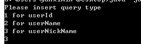

# 免登陆下载微博图片

批量下载特定用户的高清大图

## 用法

下载`bin/wb.jar`
运行`wb.jar`: `java -jar wb.jar`

  

输入`3`(当然你也可以输入1和2, 具体可以看我的[这篇博客](http://blog.yanximin.site/2017/09/05/weibo-userid-containerid/))

输入用户昵称(什么! 不知道微博昵称是什么? 看下图~ 红框处就是昵称, 求一波关注)

  

等待下载完成即可(默认保存在`E:\\img\\`目录下, 你也可以修改). So Easy!

欢迎Fork, 或者PR
