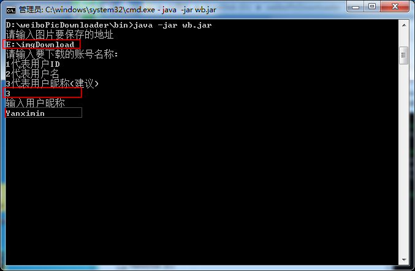

# 免登录下载微博图片

批量下载特定用户的高清大图。

## 用法

下载`bin/wb.jar`
运行`java -jar wb.jar`

>无法运行? 没有安装JAVA 参考[这篇博文](http://www.cnblogs.com/ottox/p/3313540.html)

1. 输入要保存图片的地址
2. 输入`3` 当然你也可以输入`1`和`2`, 具体可以看我的[这篇博客](http://blog.yanximin.site/2017/09/05/weibo-userid-containerid/)
3. 输入用户昵称
4. 等待下载完成即可. So Easy!

## 更新说明
- 2017年9月17日
    - 重构代码
    - 增加了多线程下载，下图的速度更快了~
    - 修复下载GIF图片时后缀不显示为`gif`的问题

## Python移植版本
[ningshu/weiboPicDownloader](https://github.com/ningshu/weiboPicDownloader)  
[nondanee/weiboPicDownloader](https://github.com/nondanee/weiboPicDownloader)  

点个Star再走呗~  
欢迎Fork, 或者PR
